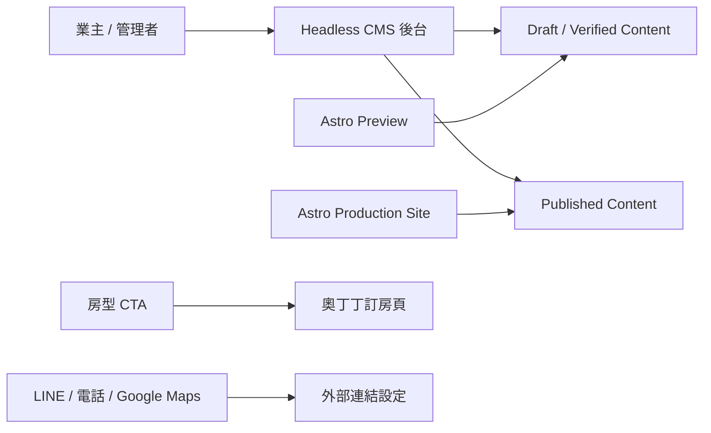
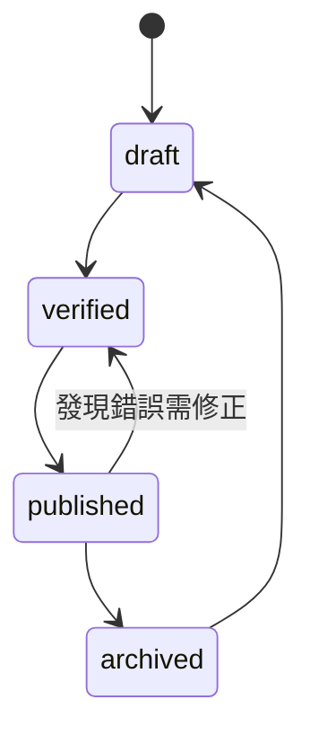

# CMS Architecture Decision

Phase 8 目標：為樂圖漫遊會館評估適合長期維護的 CMS 後台方案。  
本文件只做技術決策、資料映射與實作前規劃；不建立完整 CMS、不公開部署、不將任何內容改為 published。

## 決策摘要

建議採用：Headless CMS，優先評估 Sanity 或同級 Headless CMS。

原因：

- 業主不需要修改程式碼。
- 可用圖形化後台管理品牌、館別、房型、相簿、FAQ、政策、最新消息與 SEO。
- 可設計 `draft -> verified -> published -> archived` 內容流程。
- 前台 Astro 可在 build 或 preview 時透過 API 讀取 CMS 內容。
- 圖片、相簿排序、關聯資料與內容版本較適合民宿長期管理。
- 未來可以加入 AI 文案協助，但不必現在實作 AI。
- 不需要業主的 Mac 24 小時開機。

目前不建議立刻自行開發完整後台，也不建議把正式營運資料長期留在純 Git-based CMS，除非業主明確接受 Git 工作流與技術維護成本。

## 評估來源

正式採購前需重新確認官方價格與方案限制：

- Sanity pricing: https://www.sanity.io/pricing
- Sanity content releases: https://www.sanity.io/docs/content-releases
- Sanity Live Preview: https://www.sanity.io/docs/live-preview
- Sanity AI Assist: https://www.sanity.io/ai-assist
- Decap CMS docs: https://decapcms.org/docs/intro/
- Decap editorial workflow: https://decapcms.org/docs/editorial-workflows/
- TinaCMS docs: https://tina.io/docs/
- TinaCMS pricing: https://tina.io/pricing/
- Storyblok pricing: https://www.storyblok.com/pricing

價格與功能會變動，本文件成本估算只作決策參考。

## 三種方案比較

| 方案 | 適合程度 | 初期建置難度 | 業主操作難度 | 可能成本 | 圖片管理 | 權限登入 | 草稿發布 | 備份還原 | Astro 整合 | AI 擴充 | 平台綁定 | 維護風險 |
| --- | --- | --- | --- | --- | --- | --- | --- | --- | --- | --- | --- | --- |
| 自行開發專屬後台 | 中低 | 高 | 可做到低 | 開發費高，主機與維護另計 | 可客製，但需自建 | 需自建登入、權限、資安 | 可完全客製 | 需自建版本與備份 | 自行設計 API | 可客製 | 低，但綁定自家程式 | 高 |
| Headless CMS | 高 | 中 | 低到中 | 免費到每月數十美元起，依產品與用量 | 通常良好，支援 metadata 與 CDN | 內建帳號與角色 | 多數可支援 draft / publish / preview | 多數有版本或歷史紀錄 | Astro 可用 API 或 build-time fetch | 通常可接 AI | 中，取決於供應商 | 中低 |
| Git-based CMS | 中 | 中 | 中 | OSS 可免費，雲端代管可能每月收費 | 可用媒體庫，但大量相簿體驗有限 | 常依 Git provider 或 CMS Cloud | 可用 PR / editorial workflow | Git 版本還原強 | Astro 可直接讀檔或內容 collection | 可加，但需較多工程 | 低到中 | 中 |

## 特定產品觀察

### Sanity

適合程度：高。

優點：

- Schema 可用 TypeScript / JavaScript 定義，和目前內容模型映射自然。
- 支援結構化內容、reference、array、image metadata。
- 可做 preview，讓 verified 草稿在本機或預覽環境查看。
- 有內容版本、草稿、release、role 等能力，適合建立發布流程。
- 未來可用 AI Assist 或自建 AI workflow 做文案建議。

限制：

- 需要建立 Sanity Studio 與資料集。
- 內容存放在 Sanity 平台，存在供應商綁定。
- 付費方案與使用量需正式採購前確認。

成本概估：

- 小型民宿初期可能可從免費或低階付費方案開始。
- 若需要更多使用者、權限、版本或進階功能，可能進入每月付費。
- 圖片 CDN 與 API 用量需觀察。

### Storyblok

適合程度：中。

優點：

- 視覺化編輯體驗強。
- 適合多頁內容與行銷網站。
- Headless 架構可與 Astro 整合。

限制：

- 對兩館 12 間房的小型民宿，成本與功能可能偏重。
- 若只需要房型、FAQ、政策、照片與連結管理，可能不需要完整 enterprise 型視覺 CMS。

### Decap CMS

適合程度：中。

優點：

- Git-based，資料留在 repo。
- 成本低，版本還原直接使用 Git。
- 可和 Astro 靜態內容搭配。

限制：

- 業主操作會間接牽涉 Git 工作流。
- 圖片、相簿排序、大量媒體管理體驗通常不如專業 Headless CMS。
- 登入、部署預覽、媒體儲存與權限要另外設計。

### TinaCMS

適合程度：中到中高。

優點：

- Git-based 且有雲端後台選項。
- 編輯體驗比傳統 Git CMS 更友善。
- 可維持檔案內容與 Git 版本。

限制：

- 若使用 TinaCloud，需確認方案成本與用量。
- 長期圖片庫與多角色工作流需再做 PoC。
- 對業主而言仍比純 Headless CMS 更接近工程工作流。

## 評分表

分數 1 到 5，5 代表最符合樂圖漫遊需求。

| 評分項目 | 自行開發 | Headless CMS | Git-based CMS |
| --- | ---: | ---: | ---: |
| 業主不改程式碼 | 5 | 5 | 3 |
| 繁中或容易理解介面 | 5 | 4 | 3 |
| 圖片與相簿管理 | 4 | 5 | 3 |
| draft / verified / published | 5 | 5 | 4 |
| 草稿預覽 | 5 | 5 | 4 |
| 版本還原 | 3 | 4 | 5 |
| 手機平板基本管理 | 4 | 4 | 3 |
| 成本適合小民宿 | 2 | 4 | 4 |
| 不重做訂房系統 | 5 | 5 | 5 |
| 奧丁丁連結整合 | 5 | 5 | 5 |
| 未來 AI 擴充 | 5 | 5 | 4 |
| 維護風險 | 2 | 4 | 3 |
| 總分 | 50 | 55 | 46 |

推薦：Headless CMS。

## 推薦架構



核心原則：

- CMS 管內容，不管房價、即時房況、訂單與付款。
- 房型只存 `bookingUrl`，導向奧丁丁。
- LINE、Google Maps、Facebook、Instagram 只存正式 URL，不自行猜測。
- 前台正式環境只讀 `published`。
- 預覽環境可讀 `draft` 與 `verified`。

## Astro 整合方式

建議新增 CMS adapter layer，不讓頁面直接綁死特定 CMS。

```text
src/content/
├── cms/
│   ├── client.ts
│   ├── mapper.ts
│   └── queries.ts
├── data/
└── index.ts
```

整合策略：

- `src/content/index.ts` 維持作為唯一對外讀取 helper。
- Phase 9 或後續建立 `CMSContentSource`，將 CMS 資料轉成目前 TypeScript model。
- 本機無 CMS 時仍可讀目前 verified TypeScript 草稿。
- Production build 預設只讀 CMS 中 `published` 內容。
- Preview build 可用環境變數讀 `draft` / `verified`。

建議環境變數：

| 變數 | 用途 |
| --- | --- |
| `CMS_PROJECT_ID` | CMS 專案識別 |
| `CMS_DATASET` | CMS 資料集 |
| `CMS_API_TOKEN` | build 或 preview 讀取權限 |
| `PUBLIC_CONTENT_MODE` | `draft` 或 `published` |
| `PUBLIC_SITE_URL` | canonical 與 OG URL |

## 資料搬移方式

建議分四步，不一次切換正式來源：

1. 建立 CMS schema，對應目前內容 model。
2. 匯入 Phase 7B verified 草稿到 CMS draft / verified 狀態。
3. 建立 preview，讓業主確認 CMS 編輯後的前台畫面。
4. 確認內容、圖片與連結後，再將部分內容發布為 `published`。

不得在未完成確認前將任何資料設為 published。

## Collection 映射

### Site Profile

對應 TypeScript model：`SiteProfile`

| 欄位 | 類型 | 必填 | 公開 | 排序 | 多圖 | 關係 |
| --- | --- | --- | --- | --- | --- | --- |
| name | string | 是 | 是 | 否 | 否 | 無 |
| englishName | string | 選填 | 是 | 否 | 否 | 無 |
| slogan | text | 選填 | 是 | 否 | 否 | 無 |
| description | text | 是 | 是 | 否 | 否 | 無 |
| address | string | 是 | 是 | 否 | 否 | 無 |
| contactHours | string | 選填 | 是 | 否 | 否 | 無 |
| contacts | array object | 是 | 是 | 可排序 | 否 | 無 |
| checkInTime | string | 選填 | 是 | 否 | 否 | 無 |
| checkOutTime | string | 選填 | 是 | 否 | 否 | 無 |
| contentStatus | enum | 是 | 否 | 否 | 否 | 無 |
| published | boolean | 是 | 否 | 否 | 否 | 無 |

### Property

對應 TypeScript model：`Property`

| 欄位 | 類型 | 必填 | 公開 | 排序 | 多圖 | 關係 |
| --- | --- | --- | --- | --- | --- | --- |
| name | string | 是 | 是 | 否 | 否 | 無 |
| kind | enum love/tour | 是 | 是 | 否 | 否 | 無 |
| slug | slug | 是 | 是 | 否 | 否 | 無 |
| summary | text | 是 | 是 | 否 | 否 | 無 |
| address | string | 選填 | 是 | 否 | 否 | 無 |
| featureHighlights | array string | 選填 | 是 | 可排序 | 否 | 無 |
| coverImage | image/reference | 選填 | 是 | 否 | 否 | Media Asset |
| gallery | array image/reference | 選填 | 是 | 可排序 | 是 | Media Asset |
| displayOrder | number | 是 | 否 | 是 | 否 | 無 |
| contentStatus | enum | 是 | 否 | 否 | 否 | 無 |
| published | boolean | 是 | 否 | 否 | 否 | 無 |

### Room

對應 TypeScript model：`Room` / `RoomContent`

| 欄位 | 類型 | 必填 | 公開 | 排序 | 多圖 | 關係 |
| --- | --- | --- | --- | --- | --- | --- |
| property | reference | 是 | 是 | 否 | 否 | Property |
| roomNumber | string | 是 | 是 | 否 | 否 | 無 |
| name | string | 是 | 是 | 否 | 否 | 無 |
| slug | slug | 是 | 是 | 否 | 否 | 無 |
| summary | text | 是 | 是 | 否 | 否 | 無 |
| description | rich text | 選填 | 是 | 否 | 否 | 無 |
| standardCapacity | number | 是 | 是 | 否 | 否 | 無 |
| maximumCapacity | number | 選填 | 可公開但需確認 | 否 | 否 | 無 |
| bedSetup | string | 是 | 是 | 否 | 否 | 無 |
| amenities | array string | 選填 | 是 | 可排序 | 否 | 無 |
| bathroomAmenities | array string | 選填 | 是 | 可排序 | 否 | 無 |
| featureHighlights | array string | 選填 | 是 | 可排序 | 否 | 無 |
| notes | array string | 選填 | 是 | 可排序 | 否 | 無 |
| coverImage | image/reference | 選填 | 是 | 否 | 否 | Media Asset |
| gallery | array image/reference | 選填 | 是 | 可排序 | 是 | Media Asset |
| bookingUrl | url | 選填 | 是 | 否 | 否 | 奧丁丁外部連結 |
| lineInquiryUrl | url | 選填 | 是 | 否 | 否 | LINE 外部連結 |
| displayOrder | number | 是 | 否 | 是 | 否 | 無 |
| featured | boolean | 是 | 是 | 否 | 否 | 無 |
| contentStatus | enum | 是 | 否 | 否 | 否 | 無 |
| published | boolean | 是 | 否 | 否 | 否 | 無 |

### Media Asset

對應 TypeScript model：`MediaAsset`

| 欄位 | 類型 | 必填 | 公開 | 排序 | 多圖 | 關係 |
| --- | --- | --- | --- | --- | --- | --- |
| asset | image/file | 是 | 是 | 否 | 否 | CMS asset |
| alt | string | 是 | 是 | 否 | 否 | 無 |
| caption | string | 選填 | 是 | 否 | 否 | 無 |
| tags | array enum | 選填 | 否 | 可排序 | 否 | 無 |
| property | reference | 選填 | 否 | 否 | 否 | Property |
| room | reference | 選填 | 否 | 否 | 否 | Room |
| usageStatus | enum sample/draft/verified/published | 是 | 否 | 否 | 否 | 無 |

### Villa Rental

對應 TypeScript model：`VillaRentalContent`

| 欄位 | 類型 | 必填 | 公開 | 排序 | 多圖 | 關係 |
| --- | --- | --- | --- | --- | --- | --- |
| property | reference | 是 | 是 | 否 | 否 | Property |
| heroTitle | string | 是 | 是 | 否 | 否 | 無 |
| heroCopy | text | 是 | 是 | 否 | 否 | 無 |
| positioning | rich text | 是 | 是 | 否 | 否 | 無 |
| capacityLabel | string | 是 | 是 | 否 | 否 | 無 |
| rooms | array reference | 是 | 是 | 可排序 | 否 | Room |
| publicSpaces | array string | 選填 | 是 | 可排序 | 否 | 無 |
| amenities | array string | 選填 | 是 | 可排序 | 否 | 無 |
| serviceNotes | array string | 選填 | 是 | 可排序 | 否 | 無 |
| gallery | array image/reference | 選填 | 是 | 可排序 | 是 | Media Asset |
| phoneCtaEnabled | boolean | 是 | 是 | 否 | 否 | Site Profile |
| lineCtaUrl | url | 選填 | 是 | 否 | 否 | Link Settings |
| odingBookingUrl | url | 選填 | 是 | 否 | 否 | 奧丁丁外部連結 |
| contentStatus | enum | 是 | 否 | 否 | 否 | 無 |
| published | boolean | 是 | 否 | 否 | 否 | 無 |

### FAQ

對應 TypeScript model：`FAQ`

| 欄位 | 類型 | 必填 | 公開 | 排序 | 多圖 | 關係 |
| --- | --- | --- | --- | --- | --- | --- |
| question | string | 是 | 是 | 否 | 否 | 無 |
| answer | rich text | 是 | 是 | 否 | 否 | 無 |
| category | enum/string | 是 | 是 | 是 | 否 | 無 |
| displayOrder | number | 是 | 否 | 是 | 否 | 無 |
| contentStatus | enum | 是 | 否 | 否 | 否 | 無 |
| published | boolean | 是 | 否 | 否 | 否 | 無 |

### Policy

對應 TypeScript model：`Policy`

| 欄位 | 類型 | 必填 | 公開 | 排序 | 多圖 | 關係 |
| --- | --- | --- | --- | --- | --- | --- |
| type | enum | 是 | 是 | 是 | 否 | 無 |
| title | string | 是 | 是 | 否 | 否 | 無 |
| content | rich text | 是 | 是 | 否 | 否 | 無 |
| effectiveFrom | date | 選填 | 是 | 否 | 否 | 無 |
| displayOrder | number | 是 | 否 | 是 | 否 | 無 |
| contentStatus | enum | 是 | 否 | 否 | 否 | 無 |
| published | boolean | 是 | 否 | 否 | 否 | 無 |

### News Article

對應 TypeScript model：`NewsArticle`

| 欄位 | 類型 | 必填 | 公開 | 排序 | 多圖 | 關係 |
| --- | --- | --- | --- | --- | --- | --- |
| title | string | 是 | 是 | 否 | 否 | 無 |
| slug | slug | 是 | 是 | 否 | 否 | 無 |
| summary | text | 是 | 是 | 否 | 否 | 無 |
| coverImage | image/reference | 選填 | 是 | 否 | 否 | Media Asset |
| publishedAt | date | 是 | 是 | 否 | 否 | 無 |
| category | string/enum | 是 | 是 | 是 | 否 | 無 |
| body | rich text | 是 | 是 | 否 | 可嵌圖 | Media Asset |
| seo | object | 是 | 是 | 否 | 否 | SEO Settings |
| contentStatus | enum | 是 | 否 | 否 | 否 | 無 |
| published | boolean | 是 | 否 | 否 | 否 | 無 |

### Offer

對應 TypeScript model：`Offer`

| 欄位 | 類型 | 必填 | 公開 | 排序 | 多圖 | 關係 |
| --- | --- | --- | --- | --- | --- | --- |
| title | string | 是 | 是 | 否 | 否 | 無 |
| slug | slug | 是 | 是 | 否 | 否 | 無 |
| period | object | 選填 | 是 | 否 | 否 | 無 |
| summary | text | 是 | 是 | 否 | 否 | 無 |
| description | rich text | 選填 | 是 | 否 | 可嵌圖 | Media Asset |
| relatedRooms | array reference | 選填 | 是 | 可排序 | 否 | Room |
| cta | object | 選填 | 是 | 否 | 否 | Link Settings |
| contentStatus | enum | 是 | 否 | 否 | 否 | 無 |
| published | boolean | 是 | 否 | 否 | 否 | 無 |

### Nearby Place

對應 TypeScript model：`NearbyPlace`

| 欄位 | 類型 | 必填 | 公開 | 排序 | 多圖 | 關係 |
| --- | --- | --- | --- | --- | --- | --- |
| name | string | 是 | 是 | 否 | 否 | 無 |
| category | enum | 是 | 是 | 是 | 否 | 無 |
| distanceText | string | 選填 | 是 | 否 | 否 | 無 |
| travelTimeText | string | 選填 | 是 | 否 | 否 | 無 |
| mapUrl | url | 選填 | 是 | 否 | 否 | Google Maps |
| description | text | 選填 | 是 | 否 | 否 | 無 |
| displayOrder | number | 是 | 否 | 是 | 否 | 無 |
| contentStatus | enum | 是 | 否 | 否 | 否 | 無 |
| published | boolean | 是 | 否 | 否 | 否 | 無 |

### Site Navigation

目前未有獨立 TypeScript model，建議新增 `SiteNavigation`.

| 欄位 | 類型 | 必填 | 公開 | 排序 | 多圖 | 關係 |
| --- | --- | --- | --- | --- | --- | --- |
| label | string | 是 | 是 | 否 | 否 | 無 |
| href | string/url | 是 | 是 | 否 | 否 | 內部頁或外部連結 |
| placement | enum header/footer | 是 | 是 | 是 | 否 | 無 |
| openInNewTab | boolean | 選填 | 是 | 否 | 否 | 無 |
| displayOrder | number | 是 | 否 | 是 | 否 | 無 |
| published | boolean | 是 | 否 | 否 | 否 | 無 |

### SEO Settings

對應 TypeScript model：`SEOContent`

| 欄位 | 類型 | 必填 | 公開 | 排序 | 多圖 | 關係 |
| --- | --- | --- | --- | --- | --- | --- |
| pageKey | enum/string | 是 | 否 | 否 | 否 | Page / collection |
| title | string | 是 | 是 | 否 | 否 | 無 |
| description | text | 是 | 是 | 否 | 否 | 無 |
| canonicalPath | string | 選填 | 是 | 否 | 否 | 無 |
| ogImage | image/reference | 選填 | 是 | 否 | 否 | Media Asset |
| noindex | boolean | 選填 | 是 | 否 | 否 | 無 |
| contentStatus | enum | 是 | 否 | 否 | 否 | 無 |
| published | boolean | 是 | 否 | 否 | 否 | 無 |

## 內容狀態流程



狀態定義：

| 狀態 | 說明 | 可否正式顯示 |
| --- | --- | --- |
| draft | 內容草稿，可能不完整 | 否 |
| verified | 業主已確認，但尚未公開 | 否 |
| published | 正式公開內容 | 是 |
| archived | 下架內容，保留紀錄 | 否 |

角色建議：

| 角色 | 可修改 | 可確認 | 可發布 | 可還原 |
| --- | --- | --- | --- | --- |
| Owner 業主 | 是 | 是 | 是 | 是 |
| Editor 編輯 | 是 | 可送審 | 否 | 否 |
| Developer 開發者 | 可協助 schema / 技術 | 否，除非業主授權 | 否，除非業主授權 | 可協助 |

規則：

- 未確認內容可以在草稿預覽看到。
- 正式網站只取得 `published`。
- 不得把「待確認」文字輸出到旅客網站。
- 欄位若未知，CMS 內可顯示空白、內部備註或 validation warning。
- 發布錯誤時，用 CMS 歷史版本或 Git / export backup 還原上一版。

## 備份與復原

建議備份策略：

- 每週匯出 CMS dataset 或內容 JSON。
- 圖片保留 CMS asset library，另保留原始照片資料夾。
- 每次正式發布前建立 content release 或 snapshot。
- Astro build 使用固定版本內容，避免半完成草稿進入 production。
- 若發現錯誤，立即回復上一版 published document 或下架該內容。

## 安全與登入

建議：

- CMS 使用個人帳號登入，不共用密碼。
- 開啟二階段驗證。
- 業主帳號可發布，其他協助者只給編輯權限。
- API token 分為 read-only production token 與 preview token。
- Production token 不可讀 draft。
- Preview token 僅在受保護的預覽環境使用。
- 不把 token 放入前端公開變數。

## 未來 AI 擴充方式

Phase 8 不實作 AI，只預留：

- 房型介紹草稿生成。
- SEO title / description 建議。
- FAQ 改寫成更親切語氣。
- 圖片 alt 建議。
- 最新消息初稿。

AI 輸出必須走 draft，不可直接 published。業主確認後才可發布。

## 不選其他方案的原因

不選自行開發作為第一優先：

- 建置登入、權限、圖片庫、版本、發布流程成本高。
- 長期維護責任落在開發者身上。
- 對 12 間房的小型民宿來說過重。

不選純 Git-based CMS 作為第一優先：

- 圖片與相簿管理較容易遇到體驗瓶頸。
- 業主仍可能碰到 Git / deploy preview / PR 的概念。
- 多角色發布與草稿確認流程需額外設計。

不選高階視覺 CMS 作為第一優先：

- 對目前網站內容量可能成本偏高。
- 樂圖目前核心需求是結構化內容、圖片、連結與發布狀態，不是大型多語系行銷團隊流程。

## 正式實作前需業主決定

1. 是否接受使用第三方 Headless CMS。
2. 是否願意每月支付 CMS 費用。
3. 後台使用者有幾位。
4. 誰可以按「發布」。
5. 是否需要手機上傳照片。
6. 正式照片是否由業主上傳或由開發者整理後上傳。
7. LINE、Google Maps、Facebook、Instagram 正式網址。
8. 奧丁丁是否每間房都有獨立訂房連結。
9. 是否需要文章排程發布。
10. 是否需要正式預覽網址給業主確認。

## Phase 8 結論

推薦先做 Headless CMS 的小型 PoC：

- 1 個 Site Profile
- 1 個 Property
- 1 個 Room
- 1 個 FAQ

PoC 通過後，再進入正式 CMS schema 與資料匯入。正式實作前不得把目前 verified 內容改為 published。
