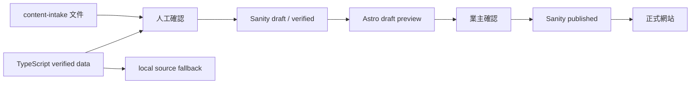

# CMS Implementation Plan

Phase 10 目標：把 Sanity PoC 轉成正式 CMS 實作前規格。  
本階段只做規劃文件，不擴充完整 CMS schema、不匯入 12 間房正式資料、不公開部署、不串接奧丁丁 API、付款、訂單或 AI。

## PoC 結論

Sanity 可以繼續作為正式 CMS 第一候選。

已驗證：

- 業主可登入 Sanity Studio。
- 可建立與編輯 Site Profile、Property、Room、FAQ。
- 可上傳封面圖、多張相簿圖，並調整排序。
- Astro draft mode 可讀取 Sanity 草稿內容。
- Production build 不會顯示未發布草稿。
- `PUBLIC_CONTENT_SOURCE=local` 可回退本地 TypeScript 內容。

主要風險：

- 業主第一次設定、CLI、Terminal、token、Draft / Published 概念需要引導。
- Sanity 免費方案對 Owner / Editor 發布權限隔離能力仍需正式確認。
- 一般 `dataset import` 會建立 Sanity 文件層級 Published，正式匯入時需使用草稿建立流程。
- Chrome 自動翻譯可能讓 Studio React 介面崩潰，後台操作需提醒關閉翻譯。

## 正式 CMS 第一階段要做

第一階段只把網站內容管理正式化，不做訂房系統。

- 建立正式 Sanity schema。
- 建立中文化、簡化後台欄位。
- 建立 Site Profile、Property、Room、Villa Rental、FAQ、Policy、News Article、Offer、Nearby Place、Media Asset、Site Navigation、SEO Settings collections。
- 建立 `draft -> verified -> published -> archived` 操作流程。
- 建立發布前檢查與防呆提示。
- 建立 Sanity 到 Astro domain model 的 mapper。
- 保留 `PUBLIC_CONTENT_SOURCE=local` 回退。
- 建立草稿預覽流程。
- 分批匯入已確認內容，先保持 draft / verified，不直接 published。
- 建立圖片上傳、命名、alt、封面與相簿排序規則。

## 暫時不做

- 不建立房價、即時房況、訂單、付款、會員。
- 不串接奧丁丁 API。
- 不啟用 AI 文案生成。
- 不公開部署 Sanity Studio 或網站，除非另開部署階段。
- 不一次匯入全部正式房型照片。
- 不刪除 TypeScript verified data。
- 不移除 local source fallback。
- 不把未確認內容顯示在旅客網站。

## 實作順序

1. 凍結 PoC schema，不再直接擴充 PoC 當正式 schema。
2. 依 `CMS_FIELD_GUIDE.md` 建立正式 schema 草案。
3. 建立中文後台 Structure，將常用欄位放前面、進階欄位折疊。
4. 建立發布規則與 validation。
5. 建立 mapper，使 Sanity model 轉成現有 TypeScript domain model。
6. 匯入 Site Profile、Love / Tour Property、少量 Room 草稿做驗證。
7. 建立草稿預覽，讓業主逐筆確認。
8. 分批匯入 12 間房、包棟、FAQ、Policy、News、SEO。
9. 完成內容與照片確認後，才允許 Owner 發布。

## 分批匯入策略

| 批次 | 來源 | 匯入內容 | 匯入狀態 | 驗收 |
| --- | --- | --- | --- | --- |
| 1 | content-intake / Phase 7B | Site Profile、Property | draft / verified | 業主確認欄位與前台預覽 |
| 2 | 03-ROOMS.md | 12 間房基本資料 | draft / verified | slug、房號、床型、建議人數正確 |
| 3 | 04-VILLA-RENTAL.md | Tour 館包棟內容 | draft / verified | 未確認押金、清潔費不顯示 |
| 4 | 05-POLICIES-AND-FAQ.md | FAQ、Policy | draft / verified | 未確認付款、取消規則不發布 |
| 5 | 06-IMAGES.md / assets-intake | Media Asset | draft / verified | alt、用途、房型對應與排序確認 |
| 6 | SEO 文件與業主確認 | SEO、Navigation、Offer、News | draft / verified | title、description、OG 圖確認 |

匯入時不得使用會覆蓋資料的指令，除非該 dataset 是新建空白且業主明確確認。

## TypeScript、content-intake 與 Sanity 關係

原則：

- `content-intake` 是資料收集與人工確認來源。
- TypeScript verified data 是目前本地草稿與回退來源。
- Sanity 是正式 CMS 來源，但第一階段不得刪除 TypeScript data。
- Production 只讀 `contentStatus == "published"` 且 Sanity 文件層級已發布的內容。
- Preview 可讀 Sanity draft / verified。

## 圖片流程

| 階段 | 位置 | 責任 | 規則 |
| --- | --- | --- | --- |
| 原始照片 | `assets-intake/original-photos/` | 業主提供，開發協助整理 | 不覆蓋、不刪除、不直接轉檔 |
| 篩選照片 | 待建立整理清單 | 業主確認房型與用途 | 標記可用、需裁切、畫質不足、需重拍 |
| 網站壓縮圖片 | 未來正式圖片目錄或 Sanity asset | 開發處理 | 依用途輸出 webp / jpg，不覆蓋原始檔 |
| Sanity asset | Sanity Media / image field | CMS 管理 | 必填 alt、用途、狀態、排序 |
| 封面圖 | Room / Property / Villa reference | 業主確認 | 每個公開房型至少 1 張 |
| 相簿 | Room gallery array | 業主可排序 | 每張有 alt，順序即前台顯示順序 |

命名建議：

- 原始照片保留原檔名。
- 正式網站圖片複製後命名，例如 `love-1201-cover.webp`、`love-1201-01.webp`。
- Sanity asset 顯示名稱使用中文用途，例如「1201 地中海豪華雙人房封面」。

## 回退方式

- `.env` 預設 `PUBLIC_CONTENT_SOURCE=local`。
- CMS 發生問題時，切回 local source 可維持網站基本顯示。
- 正式導入前不得刪除 `src/content/data/`。
- 若 Sanity schema 或資料匯入出錯，先停止發布，使用 local source 或上一版 published 內容。

## 驗收標準

- 所有正式 collections 已有欄位規格與發布條件。
- 業主常用欄位、進階欄位、隱藏/唯讀欄位已區分。
- 發布流程可避免待確認內容公開。
- 圖片來源、命名、排序與責任分工清楚。
- local source fallback 保留。
- 不實作 Phase 10 以外功能。

