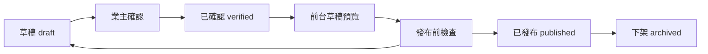

# CMS Publishing Rules

本文件定義正式 CMS 的草稿、確認、發布與下架流程。  
目標是讓業主可以安心編輯內容，同時避免未確認資料出現在旅客網站。

## 狀態定義

| 狀態 | `contentStatus` | 用途 | 可被正式網站讀取 |
| --- | --- | --- | --- |
| 草稿 | `draft` | 尚在編輯或資料待補 | 否 |
| 已確認 | `verified` | 內容由業主確認，可進入預覽 | 否 |
| 已發布 | `published` | 可公開顯示給旅客 | 是 |
| 已下架 | `archived` | 保留紀錄但不顯示 | 否 |

Sanity 文件本身也有 Draft / Published。正式網站需同時滿足：

- Sanity 文件層級已 Published。
- `contentStatus == "published"`。
- 該內容沒有未確認的公開欄位。

## 角色規則

| 角色 | 可查看 | 可編輯 | 可改成 verified | 可發布 | 可下架 |
| --- | --- | --- | --- | --- | --- |
| Owner | 是 | 是 | 是 | 是 | 是 |
| Editor | 是 | 是 | 建議可送審，不直接發布 | 否，除非付費權限支援 | 否 |

若 Sanity 免費方案無法完整限制 Editor 發布，正式導入前需改用操作流程與文件提醒補強，或升級方案。

## 操作流程

## 發布前檢查

所有內容發布前需確認：

- 沒有「待確認」、「後台測試」、「sample」、「placeholder」。
- `contentStatus` 已設為 `published`。
- Sanity 文件層級由 Owner 發布。
- 必填公開欄位已填。
- 連結是正式連結，未確認連結不啟用。
- 圖片有 alt。
- 若為房型，slug 不重複，所屬館別正確。
- 若為政策，未確認費用、押金、取消規則不顯示。

## Collection 發布條件

| Collection | 發布前必須完成 |
| --- | --- |
| Site Profile | 名稱、電話、Email、地址、Slogan、回覆時間確認；LINE / Maps 未確認則不啟用 CTA |
| Property | 館別名稱、地址、介紹、特色確認；照片若公開需 alt |
| Room | 所屬館別、房號、房名、slug、建議人數、床型、可加床說明、注意事項確認 |
| Villa Rental | Tour 館包棟內容確認；未確認押金、清潔費、訪客、設備賠償不顯示 |
| FAQ | 問題與回答確認，不含未確認規則 |
| Policy | 付款、取消、押金、寵物、訪客等敏感規則未確認不得發布 |
| News Article | 標題、日期、分類、內文、SEO 確認 |
| Offer | 不含未確認價格與期限；CTA 連結確認 |
| Nearby Place | 名稱、分類、距離或交通時間若不確定不填 |
| Media Asset | 圖片內容、用途、alt、是否正式素材確認 |
| Site Navigation | 連結不為 placeholder，外部 URL 正確 |
| SEO Settings | title、description、OG 圖確認 |

## 防呆設計

正式 schema 實作時建議：

- 在所有 schema description 寫清楚「未確認請留空，不要填待確認」。
- `contentStatus` 預設為 `draft`。
- `published` 或發布操作只由 Owner 執行。
- 若 `contentStatus != "published"`，production query 不讀取。
- 若欄位包含「待確認」、「後台測試」、「sample」、「placeholder」，發布檢查應警告。
- 房型 `odingUrl` 未填時，不顯示「立即訂房」CTA。
- LINE URL 未填時，不顯示 LINE CTA，只保留電話或聯絡頁。
- 圖片 alt 空白時，不允許發布引用該圖片的內容。

## 草稿預覽

Draft preview 使用：

- `PUBLIC_CONTENT_SOURCE=sanity`
- `PUBLIC_CONTENT_MODE=draft`
- `SANITY_PREVIEW_TOKEN`

限制：

- token 只放 `.env`，不可提交 Git。
- token 不貼在對話、文件或截圖中。
- draft preview 只能本機或受保護環境使用。

## Production 隔離

Production 使用：

- `PUBLIC_CONTENT_SOURCE=sanity`
- `PUBLIC_CONTENT_MODE=published`

規則：

- 不使用 `SANITY_PREVIEW_TOKEN`。
- 只查詢 `contentStatus == "published"`。
- 未發布的 Sanity drafts 不應出現在 `dist/`。
- build 後可用 `rg "後台測試|待確認|placeholder" dist` 做抽查。

## 下架與還原

下架：

- 將 `contentStatus` 改為 `archived`。
- 或取消 Sanity 文件發布狀態。
- 前台正式站不再讀取。

還原：

- 優先使用 Sanity 文件歷史或上一版內容。
- 若 CMS 故障，切回 `PUBLIC_CONTENT_SOURCE=local`。
- 不直接刪除內容，除非確認是測試資料或重複資料。

## 匯入與回退安全

- 正式資料匯入前先查詢固定 ID 是否存在。
- 不使用 `--replace`，除非新 dataset 空白且業主確認。
- PoC 已證明 `dataset import` 會建立文件層級 Published，正式匯入需建立 `drafts.*` 或使用安全 migration。
- 匯入後先在 draft preview 驗收，再進入 published。
- TypeScript verified data 保留到 CMS 正式穩定後再評估是否退場。

